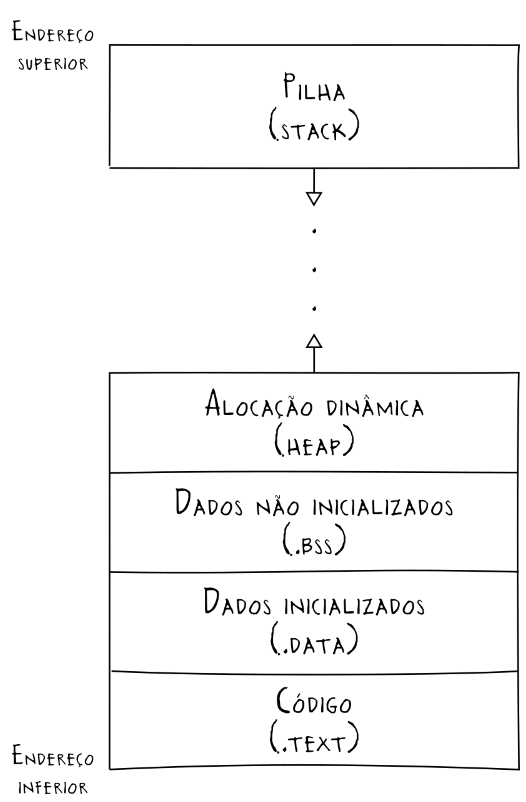

# Revisão e introdução

## Tipos

Existem diversos tipos (tipos primitivos), (float, int, char, long int, etc ), de forma que cada um ocupa espaços diferentes na memória.

| tipo           |  Bits  | Bytes |           Alcance (máx e min)           |
| -------------- | :----: | :---: | :-------------------------------------: |
| char           |   8    |   1   |    $-2^{7} \leftrightarrow 2^{7}-1$     |
| int*           | 16-64  |  2-8  |   $-2^{63} \leftrightarrow 2^{63} -1$   |
| long int*      | 32-64  |  4-8  |   $-2^{63} \leftrightarrow 2^{63} -1$   |
| long long int* |   64   |   8   |   $-2^{63} \leftrightarrow 2^{63} -1$   |
| short int      |   16   |   2   |   $-2^{15} \leftrightarrow 2^{15}-1$    |
| float          |   32   |   4   |   $1.2^{-38}\leftrightarrow 3.4^{38}$   |
| double         |   64   |   8   |  $2.3^{-308}\leftrightarrow 1.7^{308}$  |
| long double*   | 80-128 | 10-16 | $3.4^{-4932}\leftrightarrow 1.1^{4932}$ |
\***tamanho e alcance dependentes da plataforma**
Agora, temos os tipos *unsigned*, cujo valor vai de 0 até o seu valor máximo positivo, ao contrário dos tipos *signed*, que possuem valores negativos e positivos.

| tipo                    | Bits  | Bytes |     Alcance (máx e min)      |
| ----------------------- | :---: | :---: | :--------------------------: |
| unsigned char           |   8   |   1   | $0 \leftrightarrow 2^{8}-1$  |
| unsigned int*           | 16-64 |  2-8  | $0 \leftrightarrow 2^{64}-1$ |
| unsigned long int*      | 32-64 |  4-8  | $0 \leftrightarrow 2^{64}-1$ |
| unsigned long long int* |  64   |   8   | $0 \leftrightarrow 2^{64}-1$ |
| unsigned short int      |  16   |   2   | $0 \leftrightarrow 2^{16}-1$ |
\***tamanho e alcance dependentes da plataforma**

A partir do tamanho desses tipos, é possível alocar a quantidade necessária de memória para um valor que se deseja armazenar ou um grupo de valores, seja essa alocação estática ou dinâmica.

>[!Dica]
>Existe uma biblioteca chamada `stdint.h` que padroniza o tamanho dos inteiros, garantindo que a precisão e o tamanho máximo dos números seja o mesmo em todas as plataformas executadas, e assim, que código seja portável.

## Organização dos bytes na memória (*endianess*)

*Endianess* é o termo que se refere à organização sequencial dos bytes de alguma estrutura na memória. Essa organização é importante para que os dados sejam trocados corretamente entre programas e sistemas diferentes. 

>[!Importante]
>A ordem de importância (byte mais ou menos significativo) é determinada olhando para os dados e observando a ordem dos bytes. Então por exemplo, no número `0x12345678`, em que `0x12`, `0x34`, `0x56` e `0x78` são bytes diferentes, `0x12` é o byte mais significativo e `0x78`, o menos significativo.


Existem dois tipos de *endianess:*

### Little endian

No formato *little endian*, o *byte* menos significativo é armazenado primeiro, e os outros bytes são armazenados em ordem crescente de importância.

Suponha um dado  `0xAABBCCDD` (cada letra representa um *byte*). Na notação *little endian*, isso seria armazenado da seguinte maneira

| ordem | 0      | 1      | 2      | 3      |
| ----- | ------ | ------ | ------ | ------ |
| bytes | `0xDD` | `0xCC` | `0xBB` | `0xAA` |

### Big endian

Na formatação *big endian*, o contrário acontece. Isto é, o *byte* mais significativo é armazenado primeiro, e os outros são armazenados em ordem decrescente de importância.

Podemos representar `0xAABBCCDD` na notação *Big endian* da seguinte forma:

| ordem | 0      | 1      | 2      | 3      |
| ----- | ------ | ------ | ------ | ------ |
| bytes | `0xAA` | `0xBB` | `0xCC` | `0xDD` |

>[!NOTE]
>A ordem dos **bits** em qualquer byte geralmente segue o formato *little endian*

Para descobrir a *endianess* de um sistema, basta utilizar o código a seguir:

```c
int main(void)
{
    unsigned int i = 1;
    char *c;

    c = (char *) &i;
}
```

Caso o
## Segmentos de memória



### Pilha

A pilha (stack) é a região da memória onde são armazenadas as variáveis locais no escopo executado em determinado momento, as chamadas de funções e parâmetros. Assim que esses processos ou variáveis terminam de ser executados ou usados, a pilha é liberada.

A pilha já possui tamanho predefinido, e é gerenciada pelo próprio computador, não requerendo intervenção do programador para liberar memória.

A ordem em que os dados são processados é chamadas de *LIFO* (Last In, First Out), que significa que os últimos dados adicionados serão os primeiros processados. Na prática, para a execução de uma função que requer outra para funcionar, não faz sentido que a primeira seja executada antes da segunda, pois faltaria informação.

>[!Erro associado à pilha] 
>Quando recebemos um erro de "Stack Overflow" (estouro de pilha), é porque muitas chamadas foram feitas, de forma que o espaço requerido para armazená-las é maior do que há na pilha. Isso pode acontecer com funções recursivas mal elaboradas, por exemplo.

### Heap

O heap é a parte da memória alocada dinamicamente durante a execução do programa. Ao contrário da pilha, ela é controlada pelo programador ou por um *garbage collector*, pois não é liberada automaticamente.

Para acessar dados armazenados no heap, utilizamos tipos de dados que *apontam* (sim, ponteiros) para os endereços nesse espaço da memória, permitindo que diferentes tipos de dados sejam armazenados ali. 

O heap é mais lento que a pilha, devido à alocação e à liberação manual, mas é mais flexível, pois permite o armazenamento de coleções de dados (arrays) ou de classes e objetos.

Ao mexer com o heap, é necessário ter cuidado com vazamentos de memória. Como a alocação é realizada dinamicamente, um programa com *memory leaks* pode ocupar toda a memória do computador se rodar por tempo suficiente para isso.

>[!Erro associado a ponteiros]
>Quando recebemos um erro de "Segmentation Fault" (Falha de segmentação), é porque algum ponteiro está tentando acessar um local indevido (ou nulo) da memória. Por exemplo, se tentamos escrever uma parte da memória destinada apenas a leitura, ocupada por outro programa, ou até mesmo, nula.

### Dados

A memória de dados possui as variáveis estáticas declaradas no programa, com valores inicializados ou definidos pela plataforma
### Código

A memória de código possui as operações lógicas e aritméticas, junto com os controles de fluxo (condicionais e loops), chamadas de funções, entre outros. É a parte compilada do programa.
## Ponteiros

Ponteiros são tipos de dados que armazenam um **endereço de memória**. Esse endereço de memória é onde está localizado algum conteúdo a ser acessado por meio desse ponteiro.

```C
int num =  24; //variável do tipo int
int *pointer; //ponteiro para variável int inicializado

pointer = &num; //o ponteiro px recebe o endereço da variável num
```

Assim como os outros tipos de variáveis, os ponteiros são armazenados na pilha, possuindo endereços próprios. Então é possível, por exemplo, que exista um ponteiro apontando para outro ponteiro.

>[!Dica]
>Uma boa prática para a declaração de ponteiros é apontá-los para um endereço nulo, utilizando a palavra reservada `NULL`. Sem isso, o ponteiro apenas declarado pode apontar para qualquer lugar, inclusive locais aleatórios (e indesejados).
 
>[!Dica]
>É importante que o tipo do ponteiro seja o mesmo da variável para a qual ele aponta, pois um ponteiro `int`, por exemplo, pode acessar o byte inicial da variável e os 3 seguintes, mas se o ponteiro for `char`, ele só acessará o byte inicial (variável `char` possui 1 byte).
### Operadores

#### Operador `*` (desreferenciamento)

O operador `*` serve para **desreferenciar** o ponteiro, ou seja, acessar a informação armazenada no endereço de memória que o ponteiro guarda. 

```c
...
int num =  24; //armazenado em 0x87654321
int *pointer;

pointer = &num;

printf("Pointer: %p \t Value: %d", pointer, *pointer);
...
```
Saída: `Pointer: 0x87654321   Value: 24`

No exemplo acima, é possível observar que, caso utilizemos apenas o nome do ponteiro `pointer`, o valor impresso é o endereço armazenado no ponteiro. Utilizando `*pointer`, imprimimos o valor armazenado no endereço armazenado do ponteiro. 

#### Operador & (endereçamento)

O operador `&` serve para obter o **endereço** de uma variável. No exemplo anterior, `&num` representa o endereço da variável num.

## Passagem de parâmetros por valor e por referência

## Por valor

Podemos, na execução de uma função, passar um parâmetro por valor. Ou seja, passamos diretamente o valor daquela variável. 

```C
...
void func(int x){
	
	x*=3;
	printf("func: %d\n", x);
}

int main(){
	int x = 10;

	func(x);

	printf("main: %d\n", x);
	...
}
```
Retorno:
```
func: 30
main: 10
```

Com o exemplo acima, é possível perceber que, na passagem por valor, os valores passados são "copiados" para uma variável interna à função, e a variável original se mantém inalterada. Apesar de ter seus usos, para muitas aplicações, a passagem por valor não é adequada. Por isso, temos a passagem de parâmetros por referência

### Por referência

Aqui, ao invés de passarmos a variável diretamente, passamos o endereço daquela variável, permitindo que ela seja modificada. 

diretamente o valor daquela variável. 

```C
...
void func(int *x){
	
	*x *=3;
	printf("func: %d\n", *x);
}

int main(){
	int x = 10;

	func(&x);
	
	printf("main: %d\n", x);
	
}
```
Retorno:
```
func: 30
main: 30
```

Diferente do exemplo anterior, aqui, o valor da variável foi alterado para quaisquer escopos que a acessem, pois o valor passado não foi o valor da variável, mas sim, o endereço daquela variável na memória, cujo valor armazenado foi alterado pela função.

## Modificador const

O uso de `const` antes do tipo da variável garante que o valor não seja alterado, mesmo na passagem por referência, por exemplo. Caso haja uma tentativa de modificação do valor, o compilador aponta um erro, pois o valor é de *somente leitura*.

## Ponteiro de ponteiro

É possível que um ponteiro aponte para outro ponteiro. Assim, um ponteiro duplo (como também pode ser chamado) é um ponteiro que aponta para o endereço de outro ponteiro, e este aponta para o endereço de alguma variável ou algum outro dado.

```c
int main(){

	char letra = 'l';
	char* pont1 = &letra;
	char** pont2 = &pont1;
}
```

No excerto acima, o ponteiro `pont2` aponta para o endereço de `pont1`, e esse aponta para o endereço de `letra`.

### `argc` e `argv` (em C)

A função main em C pode possuir os argumentos `argc` e `argv`. Enquanto `argc` é o número de argumentos para a execução do código, `argv` representa os argumentos recebidos. Detalhe que `argc` por padrão é 1, que representa o nome do programa. Esse número pode aumentar a depender da quantidade de argumentos utilizados. Por exemplo, o programa `pessoas`, demonstrado abaixo:

```C
#include <stdio.h>
#include <string.h>

int main(int argc, char* argv[]){

	//informações sobre cada pessoa
	char nome[3][10] = {"Gustavo","Joao", "Gabriel"};
	int idade[3] = {23,15,20};
	char status[3][13] = {"Dormindo","Acordado","Trabalhando"};

	//Caso o número de argumentos seja menor que 2 (apenas o nome do programa)
	if(argc < 2){
		printf("Insira um nome!!\nSaindo...\n");
		return 1;
	}
	else{
		for(int i=0; i<argc+1; i++){
			//compara o segundo elemento do argv com cada item da lista de nomes
		    if(!strcmp(nome[i],argv[1])){
		        printf("Nome: %s\n", nome[i]);
		        printf("Idade: %d\n", idade[i]);
			    printf("Status: %s\n", status[i]);
			    return 0; //acaba o programa aqui
			}   
		}
		//caso o segundo argumento não corresponda a nenhum nome
		printf("Nome inválido\n");
	}
	return 0;
}
```

Nesse exemplo, com três listas, cada entrada correspondente à informação de uma pessoa, quando executado no terminal, o programa compilado requer um nome. Então um caso possível é:

`$:./pessoas Gustavo 

 e o retorno disso seria:
```
Nome: Gustavo
Idade: 23
Status: Dormindo
```

>[!Dica]
>Note que `argv` é um ponteiro de um ponteiro, pois representa uma lista de strings. Como strings em C são listas de caracteres, a lista de argumentos é um **array bidimensional** de caracteres, e cada "linha" da lista é separada por um espaço, na entrada desses argumentos.
## Ponteiro de função

## Alocação dinâmica x estática

Aqui temos uma tabela que compara, em termos gerais, os dois tipos de alocação

|                  Alocação dinâmica                  |                  Alocação estática                   |
| :-------------------------------------------------: | :--------------------------------------------------: |
| Variáveis de tamanho conhecido em tempo de execução |   Variáveis de tamanho fixo previamente conhecido    |
|           Alocada dinamicamente no *heap*           | Alocada estaticamente nos segmentos *.data* e *.bss* |
|             Gerenciada pelo programador             |      Gerenciada automaticamente pelo computados      |
|     Limitado pela memória disponível no sistema     | Limitado pelo compilador e pelo sistema operacional  |

## Alocação dinâmica na prática em C

Com a alocação dinâmica, podemos utilizar algumas funções úteis: 
- o `sizeof()` permite que descubramos o tamanho de uma variável pelo seu tipo (ou se for uma estrutura, o tamanho da estrutura).
(padding)
- o `malloc()` é a função utilizada para alocar memória. Ele aloca o tamanho requisitado (utilizano)
- o `calloc()` 
- o `realloc()` 
- o `free()`

### O `sizeof()`

O `sizeof()` permite que descubramos o tamanho de uma variável pelo seu tipo (ou se for uma estrutura, o tamanho da estrutura).

>[!Dica]
>Caso você possua uma `struct` `tipo` com, por exemplo, uma variável do tipo `float` (de tamanho 4) e outra do tipo `char` (de tamanho 1), e você utilizar `sizeof(tipo)`, o valor retornado será 8, e não 5. Isso acontece devido ao **padding**, que é o preenchimento de espaços inutilizados da memória, nesse caso, dos 3 bytes inutilizados. Esses bytes são preenchidos assim pois é mais fácil para o computador trabalhar com múltiplos e potências de 2. Assim, um `struct` com 2 `floats` e um `char` possui 16 bytes, e não 9.

### O `malloc()`
O `malloc()` é a função utilizada para alocar memória. Ele aloca o tamanho requisitado (utilizando, inclusive, o retorno da função `sizeof()`). Note que ele não altera os valores alocados na memória, mesmo se eles possuírem algum tipo de lixo.

```c
int main(){
	//declaração do ponteiro
	int *pont

	//alocamento de memória para 2 números inteiros.
	pont = (int*) malloc(2*sizeof(int)); 

	// inicializando os espaços do ponteiro
	p[0] = 2;
	p[1] = 13;

	//imprimindo os valores
	for(int i = 0; i<2; i++){
    printf("%d ", p[i]);
    }
	
}
```
Retorno `2 13 `.

### O `calloc()`

Assim como o `malloc()`, o `calloc()` também serve para alocar memória. Diferente do `malloc()`, que funciona com aritmética de ponteiros, o `calloc()` recebe a quantidade de elementos com o tamanho requisitado. Outra diferença é que o `calloc()` torna os valores de todos o espaço alocado para 0 (nulo), impedindo que algum lixo seja capturado na memória. Um fator importante é que isso consome mais processamento, portanto demandando mais tempo para ser feito.
 
```c
int main(){
	//declaração do ponteiro
	int *pont

	//alocamento de memória para 2 números inteiros.
	pont = (int*) calloc(2,sizeof(int)); 

	// inicializando os espaços do ponteiro
	p[0] = 2;

	//imprimindo os valores
	for(int i = 0; i<2; i++){
    printf("%d ", p[i]);
    }
	
}
```
Retorno: `2 0 `.

### O `realloc()`

O `realloc()`, diferente do `malloc()` e do `calloc()`, permite alterar a quantidade de memória alocada


### O `free()`