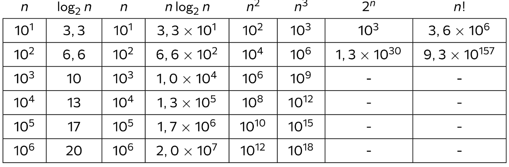
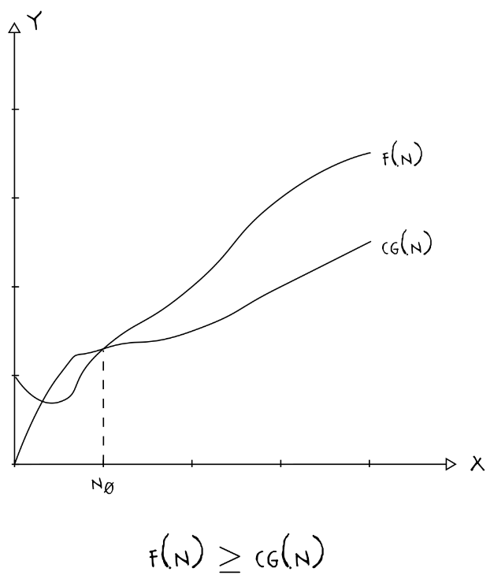
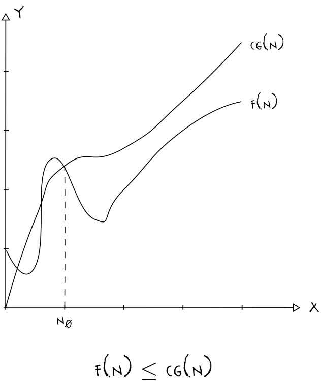

# Análise de complexidade

## O que é eficiência

É a otimização dos recursos e do tempo para realizar algo. Assim, as coisas com maior eficiência demandam menos tempo e recursos para se obter um resultado significativo.

Historicamente, computadores eram ineficientes, chegando a tomar o espaço de um prédio (ENIAC) e consumirem energia também equivalente a isso. Devido a isso, era necessário otimizar os algoritmos para que o mínimo de energia e de tempo fossem consumidos. Outro fator que influenciava era que, devido à complexidade, não haviam muitos computadores, então o uso de computadores como o ENIAC, o BINAC, o UNIVAC e os computadores da série IBM System/360 era compatilhado entre diferentes instituições e pessoas.

Hoje, a eficiência é importante devido às restrições de custo (para fabricar um produto suficientemente barato) e para o baixo consumo de potência. Com isso, é possível miniaturizar computadores e sistemas digitais e eletrônicos ao ponto de termos notebooks, celulares, wearables (smartwach, fone de ouvido, etc) e microcontroladores.

## Complexidade de tempo
A complexidade de tempo descreve o tempo necessário para que um computador execute um algoritmo dado uma entrada de determinado tamanho. A unidade de medida aqui é o **número de operações realizadas**.

Exemplo:  Ordenação de uma sequência com *n* números

### Por seleção (selection sort)

```c
void selection_sort(uint32_t* V, uint32_t n) {
	for(uint32_t i = 0; i < n - 1; i++) {
		uint32_t min = i;
		for(uint32_t j = i + 1; j < n; j++)
			if(V[j] < V[min]) min = j;
		if(i != min) trocar(&V[i], &V[min]);
	}
}
```

O número de passos aqui é 
$$N_{passos}= (n-1) +(n-2)+ ...+ 2+1 = \frac{(n-1) [1+(n-1)]}{2} \approx n²$$
Assim, por possuir 2 loops e comparar todos os números da lista entre si, a complexidade de tempo é dada por $n²$ sempre, sendo n o tamanho da entrada.

### Por inserção (insertion sort)
```c
void insertion_sort(uint32_t* V, uint32_t n) {
	for(uint32_t i = 1; i < n; i++)
		for(uint32_t j = i; j > 0 && V[j - 1] > V[j];j--)
			trocar(&V[j], &V[j - 1]);
}
```

Aqui, a ordenação é feita pegando um valor do array, e definindo como o início da lista ordenada. Depois, ele seleciona o valor seguinte, e compara com o maior valor da lista ordenada. Se esse valor da lista ordenada for maior que o selecionado, compara-se com o seguinte, até que se encontre um valor menor que ele. Quando esse valor for encontrado, o selecionado é inserido na lista, e o próximo valor não ordenado é selecionado, de forma que o mesmo algoritmo é executado.

O número de passos aqui varia, pois temos o melhor e o pior caso. O melhor caso seria **o array ordenado**, sem nenhuma operação de troca a ser feita. Tirando isso, sempre teríamos algo pra fazer. Dessa forma: $$n< N_{passos} <n²$$
Assim, o melhor caso é $n$, e o pior é $n²$.

### Como calcular a quantidade de passos?

A análise para determinar a quantidade de passos depende somente do tamanho da entrada n, afinal os outros trechos do código são constantes (não se alteram). Por exemplo:

```c
void exemplo(uint32_t n) {
	c1();
	for(uint32_t i = 0; i < n; i++)
		c2();
		for(uint32_t j = 0; j < n; j++)
			c3();
			for(uint32_t k = 0; k < n; k++)
				c4();
}
```

Aqui, as subrotinas `c1`, `c2`, `c3` e `c4` não dependem de n para funcionar, mas o valor que é iterado nos loops é justamente o valor de n. Assim $$exemplo(n) = c1+n\times\{c2+n\times[c3+(c4\times n)] \} = c1+c2 \times n + c3 \times n² + c4 \times n³$$
Dessa forma, a complexidade desse algoritmo é de $n³$

### Como calcular o tempo consumido?

Supondo o exemplo anterior com uma entrada $n = 1000$. Suponha também que $c1 = 200ns,c2=150ns,c3 =250ns, c4=100ns$. Assim, o tempo levado é de

$$(200 + 150\times 1000 + 250 \times 1000² \times + 100 \times 1000³)ns \approx 100s  $$
Quanto maior o tamanho da entrada, maior é o fator de *maior grau* da função, nesse caso, o $n³$. Assim, esse fator é o que determina a maior parte do tempo consumido. Nesse caso, é possível afirmar que
$$exemplo(n) \le g(n), g(n) = c\times n^{3}$$
### Análise assintótica

Os valores das constantes dependem da máquina, e se analisa a ordem de complexidade por meio de $n \rightarrow \infty$ 

$$\lim_{n \rightarrow \infty}{\frac{exemplo(n)}{g(n)}} = \begin{cases} O & exemplo(n)<g(n) \\k & exemplo(n)=g(n) \\\infty & exemplo(n)>g(n)\end{cases}$$
Sendo g(n) um valor equivalente à complexidade no pior caso (no caso de $exemplo(n)$, $c \times n³$)

## Complexidade de espaço

A complexidade de espaço descreve o espaço utilizado fisicamente na memória do computador, dada uma entrada de determinado tamanho. A unidade utilizada aqui é justamente o **tamanho da alocação de memória necessária.**

Exemplo:  Ordenação de uma sequência com *n* números
### Por inserção (insertion sort)
```c
void insertion_sort(uint32_t* V, uint32_t n) {
	for(uint32_t i = 1; i < n; i++)
		for(uint32_t j = i; j > 0;j--)
			if( V[j - 1] > V[j])
				trocar(&V[j], &V[j - 1]);
}
```

Tome como exemplo o mesmo algoritmo de inserção utilizado anteriormente. Assim, para essa implementação do insertion sort: $$insertion_sort(n) = c_{uint32\_t} \times n +c_{uint32\_t} \times 3 $$
>[!NOTE]
>O $c_{uint32\_t} \times 3$ representa os 3 valores inteiros alocados pelo programa (`i`, `j` e o valor `n`)
### Como calcular a memória alocada?

 A expressão para o cálculo aqui também será em função de $n$, e as constantes dependem do tamanho dos dados. Quanto maior o tamanho de $n$, maior é o fator de *maior grau* da função.

### Análise assintótica

Assim como na análise de tempo, os valores das constantes dependem da máquina, e se analisa a ordem de complexidade por meio de $n \rightarrow \infty$ 

$$\lim_{n \rightarrow \infty}{\frac{exemplo(n)}{g(n)}} = \begin{cases} O & exemplo(n)<g(n) \\k & exemplo(n)=g(n) \\\infty & exemplo(n)>g(n)\end{cases}$$
Sendo g(n) um valor equivalente à complexidade no pior caso

## Ordem de Crescimento

Classes de complexidade para entrada n:




## Exemplo para cálculo de complexidade

Para calcular a complexidade de tempo e espaço para uma função de fatorial, por exemplo, podemos descrever a implementação iterativa do fatorial, de forma que tudo fique justificado.

Sabemos que $1! = 1$ e $0! = 1$. Assim, para esses, $n = 0$. Ou seja, o tempo para realização deles é 0 (constante). Agora se pegarmos qualquer número maior que 1, sabemos que a função de fatorial se torna $n! = n \times (n-1)!$, assim, tornando a complexidade disso maior que 0 (n), pois seu crescimento é linear. Em outras palavras: 
$$Fatorial(n) = \begin{cases} 1 & n=0 \\ n \times Fatorial(n-1) & n>0 \end{cases}  $$
## Notações matemáticas

### Notação O

A notação O (ou Big O) é a formalização da complexidade de algoritmos, medindo, justamente, a complexidade dos algoritmos quando a entrada (o valor de $n$) tende a $\infty$.

Outras notações são a notação $\Omega$, para melhor caso, e a notação $\Theta$ para um caso médio. Para analisar esses casos, vamos utilizar o exemplo de busca sequencial, denotado abaixo:

```c
int32_t busca(int32_t elem, int32_t V[], uint32_t n) {
	int32_t r = -1;
	for(uint32_t i = 0; r == -1 && i < n; i++)
		if(V[i] == elem)
			r = i;
	return r;
}
```

Esse exemplo pode ser descrito pela equação $$busca(n) = c_A + c_B \times n$$
### Análise do melhor caso ($\Omega$)

A situação de melhor caso é a que possui o menor número de passos realizados. No caso da busca sequencial, o melhor caso é quando o primeiro elemento é o elemento desejado em um vetor sem repetições (O(1)).

Suponha que existem $c$ e $n_0$ tal que $(0\le cg(n) \le busca(n)), \forall n\ge n_0$   . Logo, $$\Omega(busca(n)) = \Omega (g(n)) = \Omega(c_A + c_B) = c_{MC}$$  

### Análise do pior caso ($O$)

É justamente a análise que descreve a situação que requer o maior número de passos para ser executada. É também a mais utilizada para a análise de algoritmos. Estabelece um limitante superior. No exemplo da busca sequencial, o melhor caso é quando o elemento desejado está na última posição do array.

Suponha que existem $c$ e $n_0$ tal que $(0\le busca(n))\le cg(n) , \forall n\ge n_0$   . Logo, $$O(busca(n)) = O(cg(n)) = O(c_A + c_B) = c_{PC} \times n$$

#### Propriedades da notação $O$
* Termos constantes: $O(c) = O(1)$
* Multiplicação por constantes: $O(c\times f(n))= O(f(n))$ 
* Adição: $O(f_1(n)) + (f_2(n)) = O(|f_1(n)| + |f_2(n)|)$
* Produto: $O(f_1(n)) \times (f_2(n)) = O(f_1(n) \times f_2(n))$

### Caso médio ($\Theta$)

Aqui, são feitas análises de quaisquer possíveis valores de tempo entre o melhor e o pior caso. Os casos médios para o exemplo da busca sequencial são a busca para qualquer valor entre 1 e 999, dado um vetor de 1000 elementos, por exemplo.

Suponha que existem $c$ e $n_0$ tal que $(0\le c_1g(n) \le busca(n)\le c_2g(n)), \forall n\ge n_0$   . Logo, $$\Omega(c_{MC}) \le busca(n) \le O(n) $$