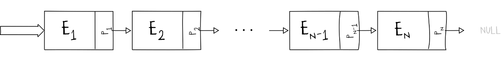
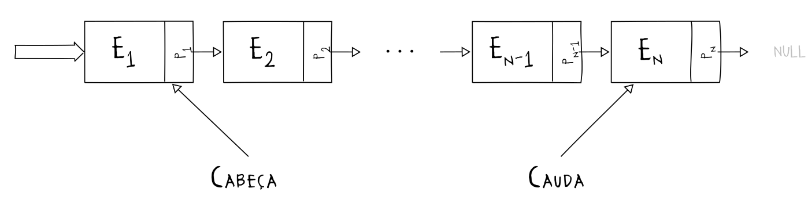
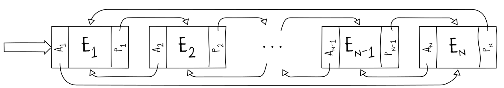

# Estrutura de lista

As estruturas de listas são sequências de elementos $E_i$, que utilizam ponteiros $P_i$ para referenciar o próximo elemento da sequência. (de forma linear)

## Lista encadeada

Possui armazenamento **descontínuo em memória**, ou seja, não precisam ser armazenados de forma sequencial na memória. Isso permite que o acesso seja mais rápido e que menos tempo seja utilizado ao aumentar ou diminuir a lista, pois não há necessidade de realocação de um bloco de memória.

O tempo de acesso da lista é sequencial, ou seja, para acessar o elemento $E_n$, eu preciso acessar todos os elementos anteriores a ele. Isso difere de um vetor, que, sabendo o índice de um elemento, o tempo de acesso é constante.

### Operações principais

As principais operações da lista encadeada são:
* Busca
* Inserção: O elemento é alocado dinamicamente, e o ponteiro é atualizado para referenciar o novo elemento inserido na lista
* Remoção: 
* Modificação
### Coleção de elementos

- Cabeça: é o primeiro elemento da lista, que aponta para o elemento seguinte.
- Cauda: É o último elemento da lista, em uma lista duplamente encadeada, podendo servir para que se volte ao longo da lista.

Na lista encadeada, cada elemento possui um ponteiro unidirecional para o próximo elemento da lista. Cada elemento é recomendavelmente acessado de forma iterativa.

### Análise de complexidade

A análise de tempo para a busca é $\Omega (1)$ e $O(n)$
Já para a inserção

## Lista encadeada cíclica

As operações são as mesmas da lista encadeada simples, mas o ponteiro do último elemento aponta para o primeiro., assim, os mecanismos de busca, inserção e remoção são parecidos, com a diferença para a cauda , que se modificada, têm que apontar para o primeiro elemento novamente.

## Lista duplamente encadeada

É a lista encadeada com dois ponteiros, que referenciam o o elemento anterior e o próximo da sequência. É possível realizar a busca de elementos da lista em ambas as direções

### Inserção
A cabeça da lista é acessada, e se um elemento nulo for encontrado, um novo elemento é inserido, apontando para si mesmo como próximo e anterior. Quando adicionado mais um elemento, os ponteiros "próximo" e o "anterior" apontam para o ponteiro novo, e os ponteiros do próximo elemento apontam para o elemento anterior. E assim por diante