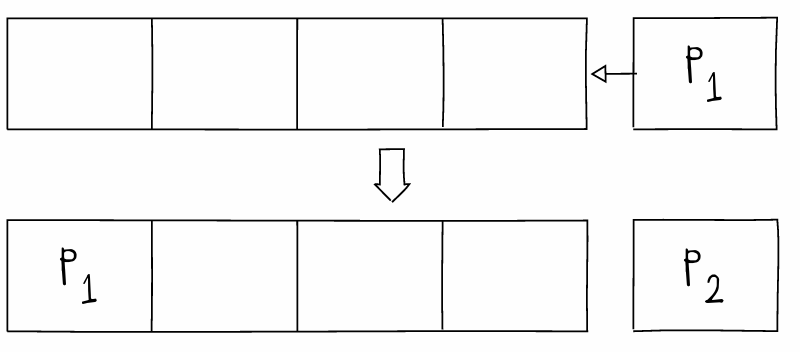
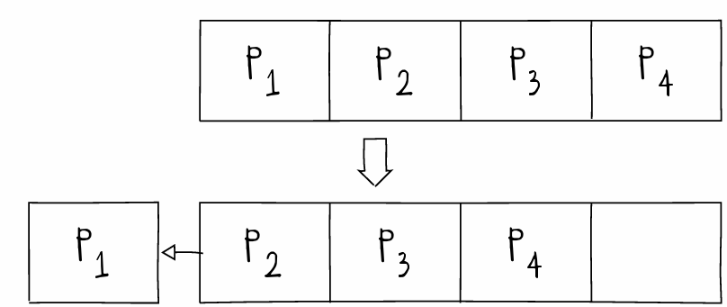

# Fila

A fila é uma estrutura de dados *First In First Out*, que possui as operações de **enfileirar** e **desenfileirar**. A restrição dessa estrutura de dados é que o primeiro elemento inserido é o primeiro a sair.

Enfileirando:

Desenfileirando:

É possível implementar a fila com **vetor** e como **lista encadeada**.

Como vetor, a estrutura do vetor é inicializada com uma capacidade *n*, com início *0* e tamanho *0*, pois o vetor não possui nenhum elemento.
