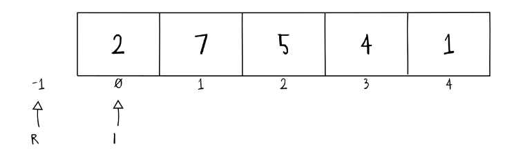

# Busca sequencial

Pode ser utilizada em estruturas de dados lineares.

## Estruturas de dados lineares

Estruturas de dados cujos elementos são armazenados em sequência, da mesma forma que suas operações (busca e organização). Já vimos estruturas assim: a fila, a pilha e a lista.

A complexidade dessas estruturas é de
- Espaço: $\Theta(n)$
- Tempo: $\Omega(1)$ e $O(n)$

## O que é o procedimento de busca sequencial?

É um processo que consiste no acesso sequencial dos dados de uma estrutura a partir de determinado elemento. Ela é finalizada quando o elemento é encontrado ou quando não existem mais elementos a serem analisados na estrutura.

>[!NOTE]
> A estratégia de busca sequencial utiliza força bruta, testando TODAS as possibilidades possíveis de busca, sendo uma implementação ineficiente para sistemas grandes (enormes). 

A busca sequencial funciona para vetores não ordenados, sendo uma das melhores operações para tal
## Como funciona a busca sequencial?

Tome como exemplo o vetor abaixo:



Considere que a variável R, que possui valor -1, indica que o elemento não foi encontrado. I recebe a posição do vetor, e, caso o parâmetro desejado seja encontrado, R recebe a posição do parâmetro e esse valor é retornado. Aqui está o código:

```c
int buscaseq(uint* V, uint n, uint x) {
	// Índice de resultado
	uint r = -1;
	// Iterações de 0 -> n - 1
	for(uint i = 0; i < n && r == -1; i++)
	// Comparação de valor
		if(V[i] == x)
			// Atualização de índice
			r = i;
	// Retornando resultado
	return r;
}
```

Em lista encadeada, ...