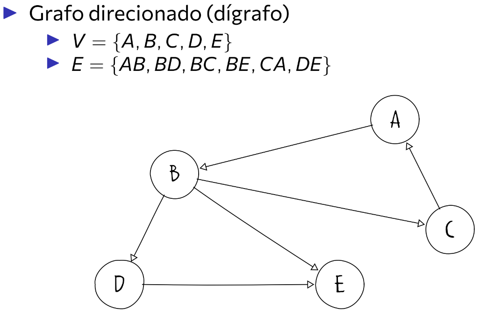
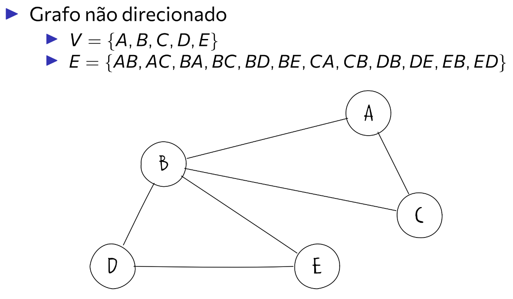
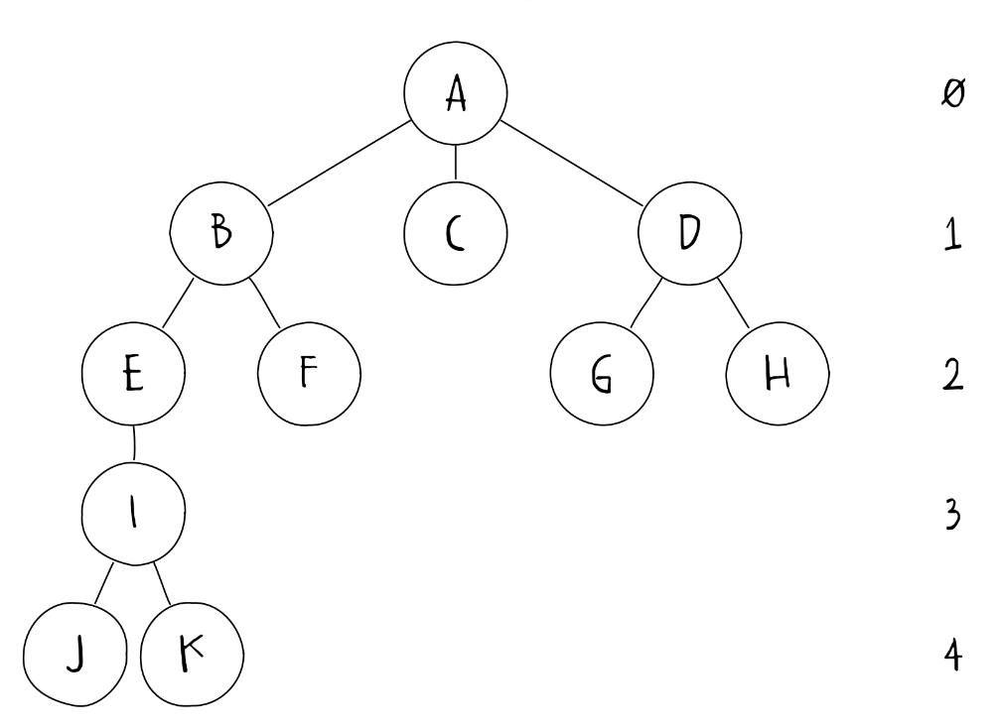
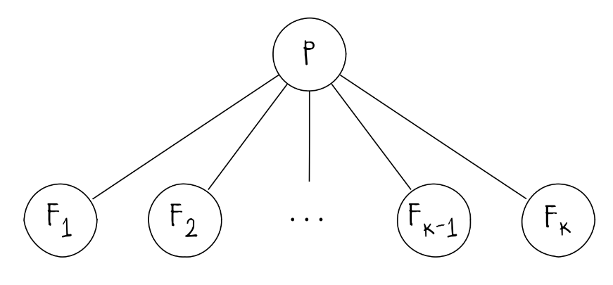
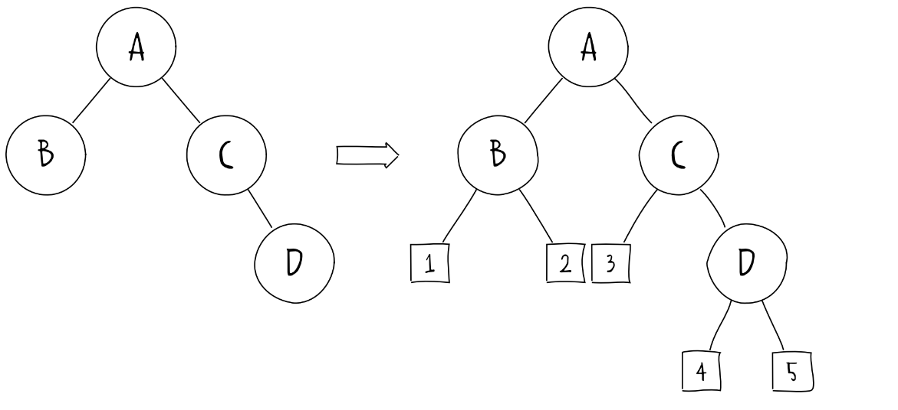
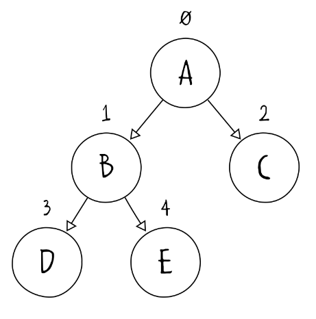
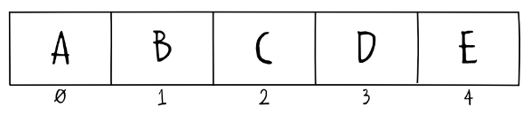

# Árvores  e Árvore binária

## Definição de árvore

Uma árvore é uma estrutura de dados não linear (sem acesso sequencial, diferente de uma lista, fila ou pilha) que possui organização hierárquica, ou seja, para acessar um registro mais a fundo, é necessário passar pelo topo. Árvores assim são excelentes para a organização de estruturas hierárquicas, como árvores genealógicas ou diretórios (pastas) de um computador, tornando o acesso a essas informações fácil e rápida, afinal não é necessário acessar cada registro de forma sequencial, nem que os elementos estejam ordenados.

## Tipos de árvores

### Grafos (Árvores não enraizadas)

São estruturas sem uma raiz definida, que possui V vértices (ou nós), conectados por E arestas. Cada aresta pode possuir um peso associado. 

$$G(V,E); \; V=\{v_1,v_2,...,v_n\},\; E=\{e_1,e_2,...,e_m\}$$
Os grafos podem ser **direcionados**, de forma em que uma aresta só conecta dois vértices em apenas um sentido:



Os grafos também podem ser não direcionados, de forma que as arestas conectam os vértices nos 2 sentidos:



### Árvores enraizadas

São estruturas com um nó especial chamado de raiz, que é o topo (início) da hierarquia da árvore. Ela possui níveis e outras subárvores.




### Árvore k-ária

É uma árvore enraizada a qual cada nó possui *k* subárvores ou nós filhos. O número de subárvores define o grau do vértice.



Um tipo de árvore K-ária, é a **Árvore binária**

## Árvore Binária

É uma árvore enraizada em que cada nó (pai) possui no máximo dois nós filhos, podendo estes serem assimétricos, ou seja, as associações e a ordem dessas importa.

### Propriedades

- Uma árvore binária que possui n nós internos possui n+1 nós externos:
	- Cada nó interno possui exatamente 2 filhos, com 2n ramos
	- Existem n-1 ramos conectando os nós internos



- Para qualquer árvore binária não vazia com $n_0$ nós folha (nós sem filho) e $n_2$ nós de grau 2, $n_0 = n_2 + 1$, sendo que o total de nós da árvore é $n = n_0 + n_1 + n_2$
	- A árvore possui $n-1$ ramos, conectados a nós de grau 1 ou grau 2
	- Assim, 
	$$n-1 = n_0 + n_1 + n_2 -1 \implies n = n_2 + n_1 + n_2 + 1 \implies \underline{n = n_1 + 2n_2 + 1} $$
- O número máximo de nós em $i$ é $2^i$, $i \ge 0$, seguindo uma progressão geométrica em que a cada passo, o número máximo de nós duplica.
(continuar propriedades na aula)


### Estrutura

Cada nó possui:
- Uma informação desejada
- Um ponteiro para o nó filho esquerdo
- Um ponteiro para o nó filho direito

```cpp
struct No {
	// Chave do nó
	int C;
	// Filho da direita
	no* D;
	// Filho da esquerda
	no* E;

	No(int conteudo): C(conteudo), D(NULLPTR), E(NULLPTR) {}

};

```

A implementação da árvore pode utilizar a estrutura similar com a de lista, utilizando ponteiros, ou a de vetor, o que permite utilizar seu índice:



Em um vetor, como o abaixo:



A raiz possui índice 0, e cada pai possui índice i. Cada filho da esquerda possui índice $2i+1$ e cada filho da direita possui índice $2i + 2$ 

Para acessar cada lado do vetor, basta implementar o seguinte (em cpp):

```cpp

struct ArvoreBin{
	no* raiz;
	int quantidadeNos;
	int altura;
	
	ArvoreBin(int conteudo){
		raiz = new No(conteudo)
		raiz->C = ;
		quantidadeNos = 0;
	}

	//RESTO DA IMPLEMENTAÇÂO...

	void adicionarNo(int conteudo){
		No* novo = new No(conteudo);
			
	}

	int noEsquerda(int i){
		return 2*i + 1;
	}
	
	int noDireita(int i){
		return 2*i + 2;
	}
}
```

### Tipos de percurso

Existem três tipos de percurso em uma árvore binária:

#### Em ordem

É um percurso no qual o primeiro nó percorrido é a folha mais à esquerda, depois o nó pai desse, e depois o nó filho da esquerda, depois voltando ao nó "avô" deste, nessa sequência (EPD).

#### Pré-ordem

É o percurso no qual o nó pai é o primeiro a ser percorrido, depois o nó filho à esquerda até chegar numa folha, e depois o nó à direita desse, e assim por diante (PED).

#### Pós ordem

É o percurso no qual o primeiro nó percorrido é, novamente, o da esquerda, mas o próximo é o nó da direita, e depois o nó pai, (EDP).