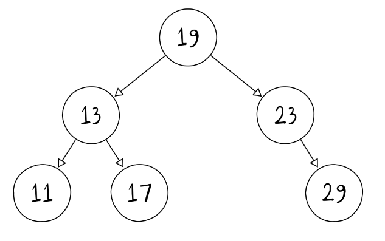

# Árvore Binária de Busca

É uma árvore enraizada em que cada nó possui uma chave associada para realização de busca

O filho da esquerda de um elemento é menor ou igual ao seu elemento pai. Já o filho da direita é maior ou igual. Isso implica que todos os elementos da esquerda são menores que a raiz, e todos os elementos da direita são maiores que ela. Outra implicação é que TODOS os elementos da esquerda são menores que os da direita.

## Propriedades

- A realização do percurso em ordem da árvore binária fornece a sequência ordenada de elementos
- Para encontrar o menor e maior elementos da árvore, basta percorrer o percurso até cada extremidade da árvore
- É possível particionar a árvore em uma determinada chave K em subárvores com elementos maiores e menores que 17

## Operações

