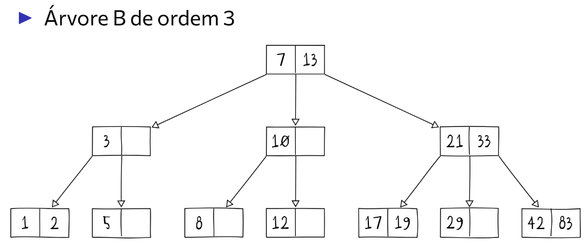

# Árvores B

Uma árvore B, diferente das árvores estudadas até agora (Binária e AVL), é uma árvore *k-ária*, ou seja, ela possui um número $k$ de ramos. Ela é balanceada, de forma que todos os nós folha ficam no mesmo nível.
A árvore B foi idealizada em 1970 por Rudolf Bayer e Edward McCreight, enquanto eles trabalhavam no *Boeing Scientific Research Labs*. Não se sabe se o nome **B** vem de Boeing ou de Bayer.

## Propriedades

- Cada nó da árvore B de ordem $k$ possui de $\frac k2$ a $k$ filhos (com exceção da raiz e dos nós folha). 
- Cada nó armazena um conjunto de $k-1$ chaves
- Todos os nós folha estão no mesmo nível

### Exemplos




 
## Definição da estrutura 

Cada nó de uma árvore B de ordem $k$ é composto por um vetor com $k -1$ elementos (chaves) e outro com $k$ ponteiros para os nós filhos. Em C:

```c
typedef struct no {
// Vetor de chaves
uint32_t* C;
// Vetor de filhos
struct no** P;
// Capacidade utilizada
uint32_t n;
} no;
```

## Operações

### Busca

A busca se inicia na raiz da árvore, na primeira chave do nó (`C[0]`), com a realização de comparações com cada chave. Se o parâmetro for menor que `C[i]` e maior que `C[i-1]`, a busca acontece no nó apontado por `P[i]`. Se for maior que `C[k-1]`, a busca é realizada em `P[k]`. Se for menor que `C[0]`, a busca é realizada em `P[0]`. Essa operação é realizada nos nós subsequentes até que se chegue a uma folha. Eis a definição em C.

```C
no* busca(no* x, uint32_t c) {
	no* r = NULL;
	if(x != NULL) {
		uint32_t i = 0;
//enquanto o indice pesquisado for menor que a capacidade utilizada e a chave for maior que a chave no índice i, incremente i
	while(i < x->n && c > x->C[i]) 
		i++;
//se o índice for menor que a capacidade e a chave buscada for igual à chave no vetor i, o valor desejado está naquele nó
	if(i < x->n && c == x->C[i])
		r = x;
//caso não esteja nesse nó, pesquise no próximo nó de acordo com os parâmetros
	else
		r = busca(x->P[i], c);
	}
	return r;
}
```

### Inserção

A inserção de uma chave em algum nó pode ser mais fácil, caso o nó em que ele será adicionado estiver completo, ou mais difícil, de forma que é necessário fazer operações para dividir o nó.

Ela ocorre sempre em um nó **folha**, sendo a árvore reajustada caso necessário.

```c

void insercao(ArvoreB* a,uint32_t c){
	if(a->raiz == NULL){
		raiz = malloc(sizeof(no));
		raiz.C[0] = c;
		raiz.n = 1;
	}
	else{
		if(raiz.n == 2*t-1){
			No* novo = malloc(sizeof(no));
			novo.C[0] = raiz;
			s->divisaoNo(raiz);
		...
		} //t == ordem da árvore
		}
}

```


A função para dividir o nó:

```c
void divisao_no(no* x) {
	uint32_t i = 0;
	//cria 2 novos nós para a divisão
	no* y = criar_no(k); 
	no* z = criar_no(k);

	//copia a metade inferior do nó x para y
	for(i = 0; i < k / 2; i++) {
		y->C[i] = x->C[i]; 
		y->P[i] = x->P[i]; 
		y->n++;
	} 
	y->P[i] = x->P[i];

	//copia a metade superior de x para z
	for(i = (k / 2) + 1; i < x->n; i++) {
		z->C[i - (k / 2) - 1] = x->C[i];
		z->P[i - (k / 1) - 1] = x->P[i]; 
		z->n++;
	} 
	z->P[i - (k / 2) - 1] = x->P[i];

	//atualização da chave de x, e dos ponteiros para y e para z
	x->C[0] = x->C[k / 2];
	x->P[0] = y;
	x->P[1] = z;
	x->n = 1;
}
```
