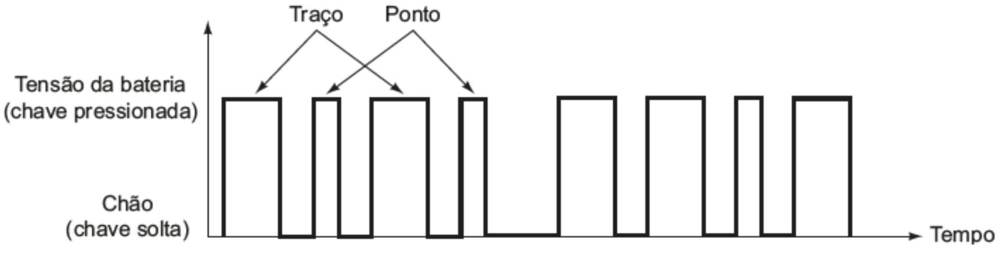
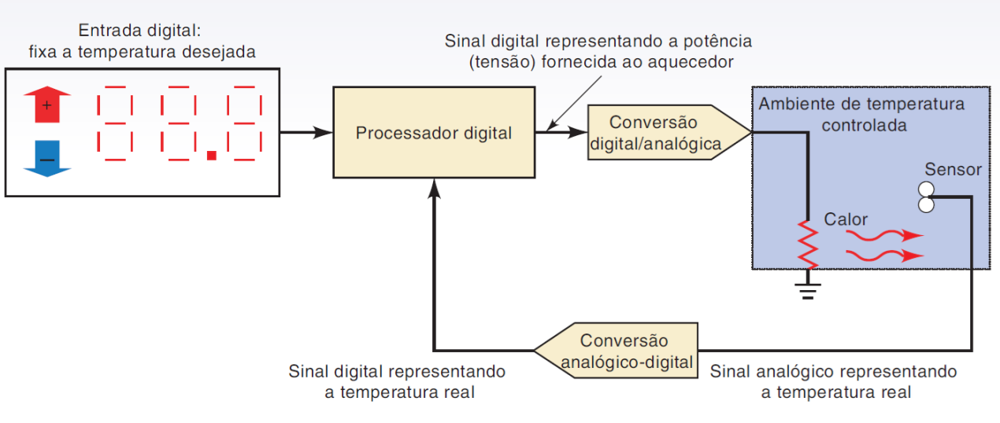

# Conceitos de sistemas digitais

Os sistemas digitais se originam de uma tecnologia de comunicação antiga: o telégrafo. O telégrafo funcionava por meio do fechamento e da abertura de um circuito com uma chave de contato, um fio longo e uma matraca (saída de som ou emissor da mensagem), que emitia ruído a depender do estado do circuito.

O telégrafo utilizava pulsos elétricos longos ou curtos, junto a espaços, para a formulação de palavras e números. Esses pulsos eram, geralmente, o **código morse**.

Um sistema digital possui apenas dois estados: Ligado e desligado, a todo momento. Não há meio termo. Os sistemas digitais modernos utilizam sinais elétricos para representar esses estados (1 ou 0). A informação é codificada na amplitude e na duração dos pulsos, bem como por meio da sequência desses pulsos. Um diagrama de tempo mostra os estados do sistema, bem como a mudança desses estados:

Diagramas de tempo como esse descrevem a operação detalhada de um sistema digital, podendo mostrar, inclusive, como eles mudam, e como dois ou mais sistemas digitais se relacionam.

## Depuração de sistemas digitais

Para depurar e analisar sistemas digitais, faz-se uso de instrumentos como o gerador de função e o osciloscópio. Este último permite a visualização do diagrama de tempo de um sinal digital, bem como comparar diferentes sinais.

## Mas o que é digital?

Digital se refere aos dígitos (números), e se contrapõe ao analógico:
* Analógico: a quantidade representada é continuamente variável, abrangendo todos os números reais.
	* Exemplo: O som, ao ser capturado por um microfone; Um velocímetro analógico
* Digital: A quantidade representada utiliza valores discretos, separados uniformemente, representados pelos dígitos.
	* Exemplo: Termômetro digital, Velocímetro digital, contagem de coisas, etc.

## Sistemas digitais

Sistemas digitais são sistemas que...

## Sistemas mistos

São sistemas que utilizam tanto informações digitais quanto analógicas. Para isso, utilizam-se conversores analógico-digital ou digital-analógico. Por exemplo, temos um sistema de regulagem de temperatura:

