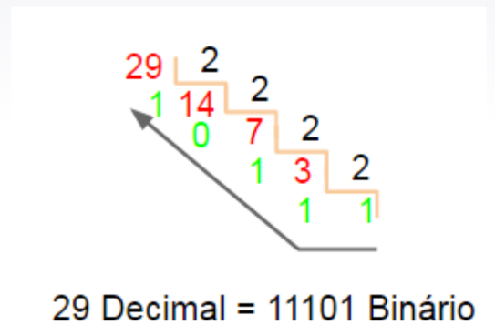

# Aula 27/05

## Transmissão Paralela e serial

É necessário realizar a transmissão de dados entre diferentes partes de um circuito. Para isso, existem dois tipos de transmissão, o **paralelo** e o **serial**.

### Transmissão paralela

É o tipo de transmissão em que vários bits são enviados de uma vez, de forma paralela. Então por exemplo, para enviar caracteres de 8 bits, cada caractere é enviado de uma vez, ou seja, os 8 bits são enviados de uma vez.

### Transmissão Serial

É o tipo de transmissão em que 1 bit é transmitido por vez, sequencialmente. Dessa forma, cada informação é separada de alguma forma. Então, por exemplo, para caracteres de 8 bits, cada bit do caractere é enviado de uma vez (a cada pulso possível).

## Circuitos combinacionais e sequenciais

### Circuitos combinacionais

A saída deles depende das entradas, e quando a entrada é removida, a saída volta ao estado original.

### Circuitos sequenciais
Possuem memória, permitindo que a saída se mantenha no estado em que foi deixada, mesmo que a entrada seja removida. Temos como exemplo, *latches* e *flip-flops*.

## Computador digital

Um computador digital possui alguns componentes como
* Os métodos de entrada
* A unidade de controle
* Uma unidade lógica/aritmética
* As unidades de memória
* Os métodos de saída

O conjunto de instruções em um computador é chamado de **software**.

O software

## Microcontroladores

São computadores mais simples, e que não podem ser configurados pelo usuário. Eles possuem todos os componentes de um computador, e são usados em aplicações de **sistemas embarcados** (eletrodomésticos, equipamentos de áudio e vídeo, máquinas de autoatendimento, etc).

## Conversões de sistemas de numeração

### Conversão binário-decimal

**colocar aqui**

### Conversão decimal-binário

Existem dois métodos para realizar a conversão de números decimais para binários:
* Pela soma das potências de dois:

| N(base 10) | $2^{5}$ | $2^{4}$ | $2^{3}$ | $2^{2}$ | $2^{1}$ | $2^{0}$ |
| ---------- | ------- | ------- | ------- | ------- | ------- | ------- |
| $58_{10}$  | 1       | 1       | 1       | 0       | 1       | 0       |

* Pelo resto das sucessivas divisões do número por 2, depois ordenando esse valor na ordem inversa:

### Sistema hexadecimal e conversão para binário

(escrever tabela)