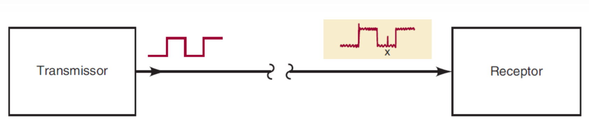

# Aula 29/05

## Código BCD

BCD significa...

## Códigos alfanumétricos

Além de dados numéricos, um computador precisa ser capaz de manipular informações não numéricas, como letras do alfabeto, sinais de pontuação, entre outros símbolos.

Um código alfanumérico inclui pelo menos:
- 26 letras maiúsculas 
- 26 letras minúsculas
- 10 dígitos numéricos
- 7 sinais de pontuação
- Outros 20 a 40 caracteres como sinais de operação (+,-,\*,/) ou outros símbolos (#, %, &,@,etc.)

A depender do idioma e da aplicação, é necessário incluir mais símbolos. Por exemplo, japonês possui 3 alfabetos, e suas palavras são escritas por composição.

A tabela ASCII determina 127 símbolos, representados por 7 bits, no máximo. Os símbolos inclusos são os citados acima, mas alguns caracteres especiais (\\0 para terminação, backspace, \\n para nova linha,, "return" (enter) etc. ).

## Bytes, nibbles e palavras

*Byte* é um conjunto de 8 bits, que pode representar quaisquer tipos de dados. Como a pronúncia é similar a mordida em inglês, temos também o *nibble*.

*Nibble* é uma "mordida pequena", representando um conjunto de 4 bits.

Palavra é um conjunto de bits variados. Então a palavra com a que os processadores atuais se comunicam é de 64 bits.

## Detecção de erros

Aqui veremos métodos de paridade para detecção de erros

Quando uma informação é transmitida entre dispositivos, há possibilidade de ocorrência de ocorrência de erros, ou seja, a informação enviada é modificada e recebida de forma errada. A principal causa de erro de transmissão é o ruído elétrico, em que, no caminho do transmissor dos dados ao receptor, o ruído pode ser introduzido à transmissão, e se sobrepor ao sinal.

A maioria dos equipamentos digitais é projetada para ser livre de ruído, de forma que a probabilidade de erros ocorrer é baixa. Apesar disso, são transmitidos milhões ou bilhões de bits, o que pode gerar distorções ou desastres. Para detectar esses erros, existem diversos métodos de detecção, como o método de paridade

### Método de paridade

Um bit de paridade é um bit extra anexado ao conjunto de bits do código transmitido. Esse bit pode ser 0 ou 1. Isso, de forma eficiente, pode ser utilizado para determinar a paridade do dado (par ou ímpar).

Esse método funciona de forma que, o número de bits altos (1) presentes em um dado sendo par, o bit de paridade é par(0). Similarmente, se o número de bits altos for ímpar, o bit é ímpar (1). Esse bit de paridade pode ser o mais ou menos significativo.

| paridade | 2⁶  | 2⁵  | 2⁴  | 2³  | 2²  | 2¹  | 2⁰  |
| -------- | --- | --- | --- | --- | --- | --- | --- |
| 0 (par)  | 1   | 0   | 0   | 1   | 1   | 1   | 0   |

| paridade  | 2⁶  | 2⁵  | 2⁴  | 2³  | 2²  | 2¹  | 2⁰  |
| --------- | --- | --- | --- | --- | --- | --- | --- |
| 1 (ímpar) | 1   | 1   | 0   | 0   | 1   | 1   | 1   |

Caso as informações agrupadas com o bit de paridade sejam alteradas em 1 ou 3 bits, o sistema entenderá que o dado está corrompido e poderá solicitar a transmissão dele novamente. Ainda assim, caso 2 ou 4 bits sejam alterados, os erros não serão detectados, pois a paridade será correspondente à esperada.

Existem outras técnicas que podem ser utilizadas para detectar e corrigir erros, mas que consomem mais bits e requerem mais processamento para detectar e corrigir os erros.