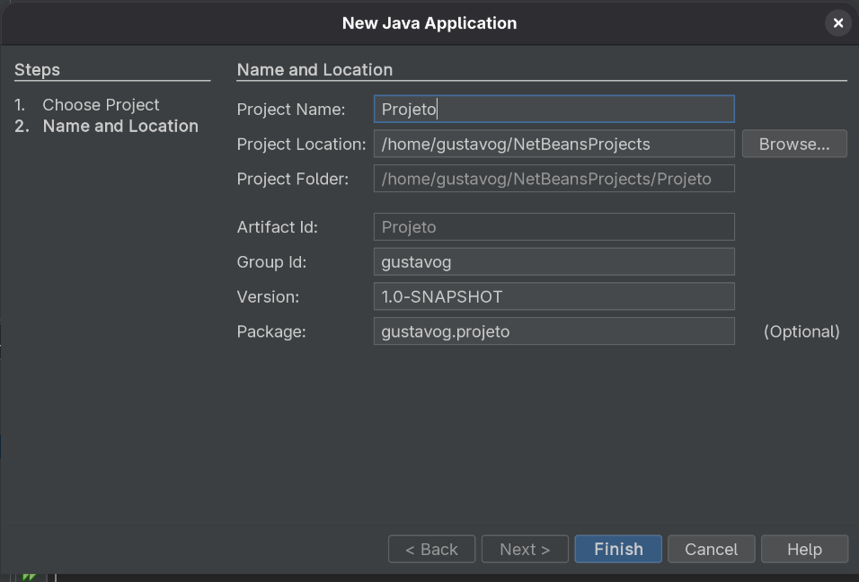
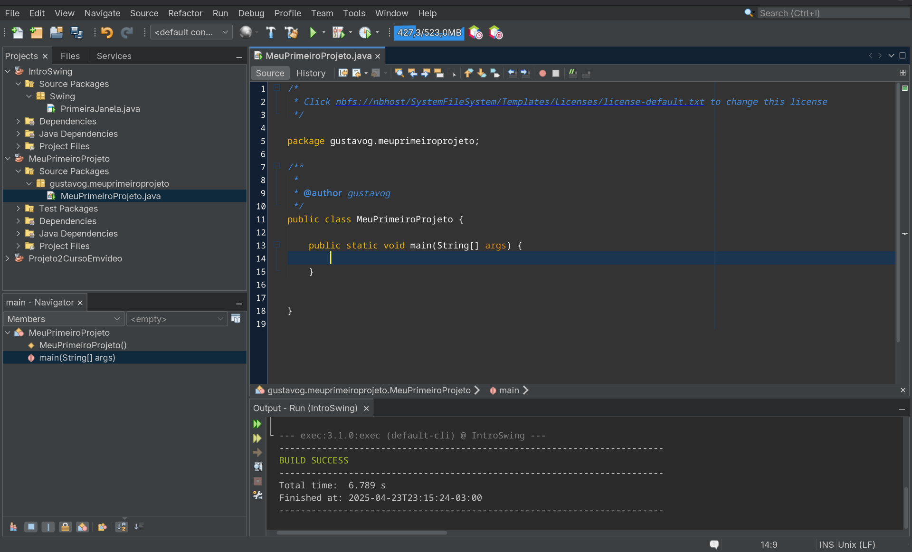

# Primeiro programa em Java

Agora que o JDK está instalado e o NetBeans configurado, podemos criar o nosso primeiro projeto.

## Criando o projeto no NetBeans

Primeiramente, ao abrir o NetBeans, você se deparará com a seguinte tela

 

Basta clicar em "New Project... " ou "Novo Projeto...", escolher, na janela seguinte, "Java With Maven" e "Java Application", dar um nome ao seu projeto, e clicar em "Finish" ou "Finalizar".



Após isso, uma tela similar a essa aparecerá:



O projeto já está criado!

## "Olá Mundo" em Java

Com o projeto criado, para escrever o seu primeiro "Olá Mundo" no terminal, usaremos um comando um tanto quanto diferente de outras linguagens. Enquanto Python utiliza `print()`, C utiliza `printf()` e JavaScript utiliza `console.log`, java utiliza `System.out.print()` ou `System.out.println()` para escrever e fazer uma quebra de linha. Para entender como essa sintaxe funciona, precisamos explorar mais a fundo. Mas inicialmente, basta escrever

```Java
public class MeuPrimeiroProjeto {

    public static void main(String[] args) {
        System.out.println("Olá Mundo!"); //<- Basta escrever isto. O resto já está lá
    }
```

## Entendendo a sintaxe

O java utiliza princípios da **Orientação a objetos**, como classes, métodos, herança e encapsulamento. Estudaremos esses conceitos mais a frente, mas para entendermos a sintaxe:

```Java
public class MeuPrimeiroProjeto { //<-Classe

    public static void main(String[] args) { //<-Método
        System.out.println("Olá Mundo!");
    }
```


Aqui, temos a classe do projeto, denominada `MeuPrimeiroProjeto`, o método principal dessa classe, denominada`main`. Ela recebe argumentos do tipo `String[]` (Uma cadeia de cadeias de caracteres) e não retorna nenhum valor.

Olhando melhor para o `System.out.println("Olá Mundo!");`, temos um padrão similar. Temos uma classe `System` com um método `out` e uma função com o nome `println`. Geralmente, é assim que a chamada de uma função funciona em Java. Perceba também que as letras iniciais de cada um desses componentes se difere, isso se deve ao uso do camelCase.

## O camelCase

