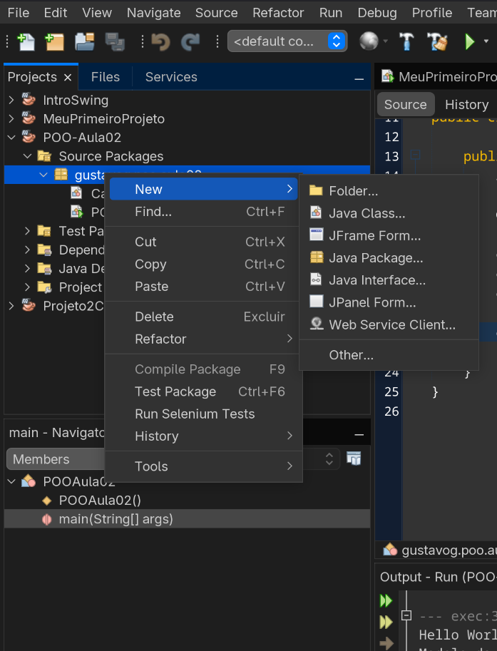

# Criando classes e objetos em Java

Agora, aplicaremos os conceitos aprendidos no documento anterior à prática. 

Imaginando um exemplo com carros, podemos atribuir ao carro:
- Fabricante (String)
- Modelo (String)
- Cor (String)
- Se é elétrico (boolean)
- a potência (int)
- O motor (1.0, 1.4, etc) (float)
- O peso (em quilogramas) (int)
Da mesma forma, o carro pode ser ligado, desligado, acelerado, freado, entre outras coisas. E assim, ele pode ter status de parado, em movimento, ligado, desligado, entre outros. Podemos implementar tudo isso com java.

## Criando a classe

Primeiro, é necessário criar um novo projeto com o que foi ensinado nas aulas anteriores. Depois, podemos criar uma nova classe.

Com o projeto criado, basta criar no nome do projeto, depois _source packages_, depois clicar com o botão direito no pacote presente na pasta, passar o mouse em *New* e clicar em *Java Class...*., como na imagem abaixo.



Ao fazer isso, uma nova janela aparecerá. Basta inserir o nome da classe e clicar em "Finish" ou "Finalizar".

Assim, nossa classe foi criada.

## Adicionando atributos e estados

Utilizando o objeto Carro citado lá em cima, podemos adicionar todos os atributos e estados mencionados à classe. Note que todos eles possuem seus respectivos tipos, então basta adicionar isso ao arquivo. Os atributos e estados ficariam assim:

```Java
public class Carro {
    String fabricante;
    String modelo;
    String cor;
    boolean eletrico;
    int potencia;
    float motor;
    int peso;
    boolean ligado;
    //.
    //.
    //.
```

Todos eles recebem a visibilidade (opcional e que será abordada mais a frente), o tipo (`String`, `int`, etc.) e o nome. Agora, vamos aos métodos.

```Java
	//.
    //.
    //.

	 public void status(){
        System.out.println("Fabricante: " + this.fabricante);
        System.out.println("Modelo: "+ this.modelo);
        System.out.println("Cor: " + this.cor);
        System.out.println("Elétrico? " + this.eletrico);
        System.out.println("Potência:" + this.potencia + " cv");
        System.out.println("Motor:" + this.motor);
        System.out.println("Ligado? " + this.ligado);
     
    }
    
    protected void ligar(){
        this.ligado = true;
    }
    protected void desligar(){
        this.ligado = false;
    }
    
    public void acelerar(){
        if (this.ligado == false){
            System.out.println("O carro está desligado!");
        }
        else{
            System.out.println("Acelerando...");
        }
    }   
}
```

Aqui, possuímos os métodos, que possuem novamente, visibilidade, o tipo de retorno (caso retorne algo. Se não retornar, o tipo é `void`), e o nome dos métodos acompanhado de parênteses. Aqui, temos o método `status()`, que imprime na tela todas as características e o estado do veículo, um método para ligar e outro para desligar o veículo, e outro para acelerar, que depende de o carro estar ligado.

>[!Dica]
> Para quem vem de Programação Imperativa, métodos funcionam de forma similar a funções, mas em vez de serem definidos para um escopo geral, só podem ser utilizados para o objeto em que estão definidos