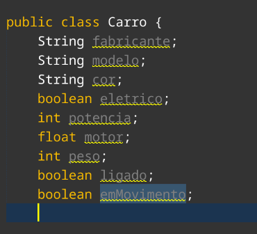

# Criando classes e objetos em Java

Agora, aplicaremos os conceitos aprendidos no documento anterior à prática. 

Imaginando um exemplo com carros, podemos atribuir ao carro:
- Fabricante (String)
- Modelo (String)
- Cor (String)
- Se é elétrico (boolean)
- a potência (int)
- O motor (1.0, 1.4, etc) (float)
- O peso (em quilogramas) (int)
Da mesma forma, o carro pode ser ligado, desligado, acelerado, freado, entre outras coisas. E assim, ele pode ter status de parado, em movimento, ligado, desligado, entre outros. Podemos implementar tudo isso com java.

## Criando a classe

Primeiro, é necessário criar um novo projeto com o que foi ensinado nas aulas anteriores. Depois, podemos criar uma nova classe.

Com o projeto criado, basta criar no nome do projeto, depois _source packages_, depois clicar com o botão direito no pacote presente na pasta, passar o mouse em *New* e clicar em *Java Class...*., como na imagem abaixo.

Ao fazer isso, uma nova janela aparecerá. Basta inserir o nome da classe e clicar em "Finish" ou "Finalizar".

Assim, nossa classe foi criada.

## Adicionando atributos e estados

Utilizando o objeto Carro citado lá em cima, podemos adicionar todos os atributos e estados mencionados à classe. Note que todos eles possuem seus respectivos tipos, então basta adicionar isso ao arquivo. Os atributos e estados ficariam assim:

